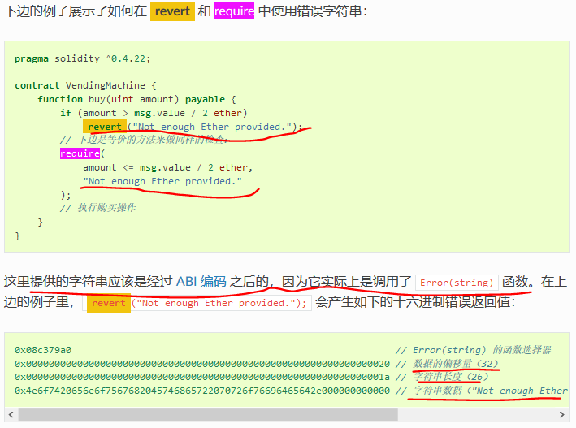
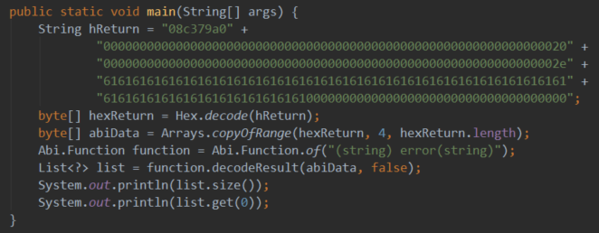

# 以太坊：Solidity中require异常消息EVM是怎么解析的

**欢迎转载，但须指明出处：**[https://github.com/chenjw13097/papers](https://github.com/chenjw13097/papers/blob/master/%E5%8C%BA%E5%9D%97%E9%93%BE/%E4%BB%A5%E5%A4%AA%E5%9D%8A%EF%BC%9ASolidity%E4%B8%ADrequire%E5%BC%82%E5%B8%B8%E6%B6%88%E6%81%AFEVM%E6%98%AF%E6%80%8E%E4%B9%88%E8%A7%A3%E6%9E%90%E7%9A%84/%E4%BB%A5%E5%A4%AA%E5%9D%8A%EF%BC%9ASolidity%E4%B8%ADrequire%E5%BC%82%E5%B8%B8%E6%B6%88%E6%81%AFEVM%E6%98%AF%E6%80%8E%E4%B9%88%E8%A7%A3%E6%9E%90%E7%9A%84.md)  
  
https://solidity-cn.readthedocs.io/zh/develop/control-structures.html?highlight=revert%20  
  
  
经过实际程序来看下：  
```
pragma solidity ^0.4.12;

contract DataStore {
    constructor () public {
        require(80==11, "aaaaaaaaaaaaaaaaaaaaaaaaaaaaaaaaaaaaaaaaaaaaaa");
    }
}
```
部署的时候就会返回为revert，此时的校验不过说明字符串在程序结果的hReturn中保存：  
  
08c379a0
0000000000000000000000000000000000000000000000000000000000000020
000000000000000000000000000000000000000000000000000000000000002e
6161616161616161616161616161616161616161616161616161616161616161
6161616161616161616161616161000000000000000000000000000000000000
  
解析这个结果时需要先去掉函数签名的4个字节。  
  
结果输出如下：  
  
