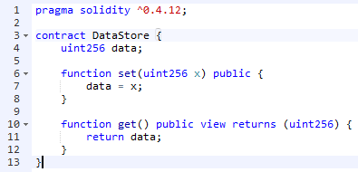
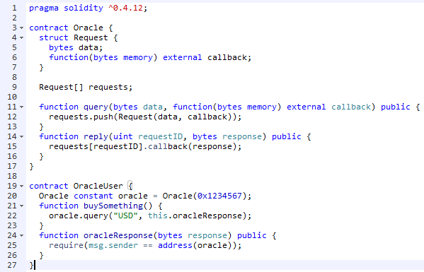
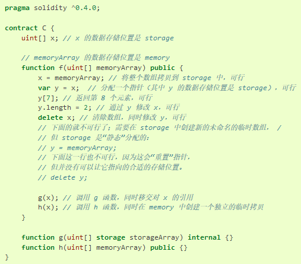
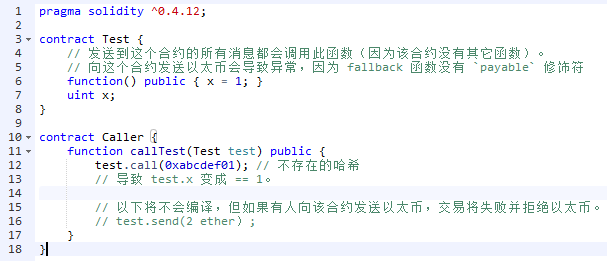

# 以太坊：Solidity语言语法速记

### 为创建智能合约而设计的语言

Solidity是一门程序设计语言，为创建能在EVM上运行的智能合约而设计的。  
  
目前，编写Solidity代码最好的IDE是Remix，它是基于浏览器的在线IDE，0.4.24版本编译器对应的网址为：  
[https://remix.ethereum.org/#optimize=true&amp;version=soljson-v0.4.24+commit.e67f0147.js](https://remix.ethereum.org/#optimize=true&amp;version=soljson-v0.4.24+commit.e67f0147.js)  
  
Solidity源码实例如下。  
  
  
编译后得到的就是能在EVM中执行的字节序列。  
608060405234801561001057600080fd5b5060bf8061001f6000396000f30060806040526004361060485763ffffffff7c010000000000000000000000000000000000000000000000000000000060003504166360fe47b18114604d5780636d4ce63c146064575b600080fd5b348015605857600080fd5b5060626004356088565b005b348015606f57600080fd5b506076608d565b60408051918252519081900360200190f35b600055565b600054905600a165627a7a72305820d8a40958ffb63a1d224c2c1e92ac7306393c0e262ecadd190cbcf6139159ffef0029  
  
其汇编如下。  
PUSH1 0x80 PUSH1 0x40 MSTORE CALLVALUE DUP1 ISZERO PUSH2 0x10 JUMPI PUSH1 0x0 DUP1 REVERT JUMPDEST POP PUSH1 0xBF DUP1 PUSH2 0x1F PUSH1 0x0 CODECOPY PUSH1 0x0 RETURN STOP PUSH1 0x80 PUSH1 0x40 MSTORE PUSH1 0x4 CALLDATASIZE LT PUSH1 0x48 JUMPI PUSH4 0xFFFFFFFF PUSH29 0x100000000000000000000000000000000000000000000000000000000 PUSH1 0x0 CALLDATALOAD DIV AND PUSH4 0x60FE47B1 DUP2 EQ PUSH1 0x4D JUMPI DUP1 PUSH4 0x6D4CE63C EQ PUSH1 0x64 JUMPI JUMPDEST PUSH1 0x0 DUP1 REVERT JUMPDEST CALLVALUE DUP1 ISZERO PUSH1 0x58 JUMPI PUSH1 0x0 DUP1 REVERT JUMPDEST POP PUSH1 0x62 PUSH1 0x4 CALLDATALOAD PUSH1 0x88 JUMP JUMPDEST STOP JUMPDEST CALLVALUE DUP1 ISZERO PUSH1 0x6F JUMPI PUSH1 0x0 DUP1 REVERT JUMPDEST POP PUSH1 0x76 PUSH1 0x8D JUMP JUMPDEST PUSH1 0x40 DUP1 MLOAD SWAP2 DUP3 MSTORE MLOAD SWAP1 DUP2 SWAP1 SUB PUSH1 0x20 ADD SWAP1 RETURN JUMPDEST PUSH1 0x0 SSTORE JUMP JUMPDEST PUSH1 0x0 SLOAD SWAP1 JUMP STOP LOG1 PUSH6 0x627A7A723058 KECCAK256 0xd8 LOG4 MULMOD PC SELFDESTRUCT 0xb6 GASPRICE SAR 0x22 0x4c 0x2c 0x1e SWAP3 0xac PUSH20 0x6393C0E262ECADD190CBCF6139159FFEF002900  

### 基本语法

#### 所有标识符只能使用ASCII字符集

所有的标识符都只能使用ASCII字符集。但字符串变量可以存储UTF-8编码的数据。  

#### 指定Solidity版本

pragma solidity ^0.4.12;  
告诉大家源代码使用Solidity版本0.4.12写的。某个编译器版本如果支持Solidity的某个版本，那么它也会支持Solidity该版本的之前的任何版本。  

#### 定义合约

contract DataStore {……}  
定义一个合约。可以将合约类比Java的类，它也包含了状态和行为。由于以太坊区块链的类似版本控制系统的设计，随着区块的增加，状态会被覆盖，但都是以增量的形式，也就是说，历史状态不会被删除。 

#### 声明一个public的变量

uint256 public data;  
public会使自动生成一个函数，允许你在这个合约之外访问这个状态变量的当前值。生成的函数为：data()。  

#### 声明和触发事件

eventSent(addressfrom,addressto,uintamount);  
声明了一个事件。  
  
emit Sent(msg.sender, receiver, amount);  
触发一个指定的事件。  

事件在区块链中被记录为日志，被索引的参数会生成布隆过滤器，记录到参数级、事件级、交易级、区块级等不同层级的布隆过滤器，以便高效地查找日志。  

anonymous 修饰事件时，不把事件签名作为 topic 存储。  
indexed 修饰事件参数时，将参数作为 topic 存储。  
```
event Deposit(  
    address indexed \_from,  
    bytes32 indexed \_id,  
    uint \_value  
);  
```
logi 接受 i+1 个 bytes32 类型的参数。其中第一个参数会被用来做为日志的数据部分， 其它的会做为 topic。  

  

其中的长十六进制数的计算方法是 keccak256(&quot;Deposit(address,hash256,uint256)&quot;)，即事件的签名。  

#### mapping类型

mapping (address => uint) public balances;  
balances[receiver] += amount;  
或者balances(receiver)  
在映射中，实际上并不存储 key，而是存储它的 keccak256 哈希值，从而便于查询实际的值。  

#### 获取源外部交易的发起者

msg.sender  

#### 定义构造方法

如何用为Coin的构造方法：  
function Coin() public {  
    minter = msg.sender;  
}  

也可以如下：  
constructor(uint256 x) public {  
    data = x;  
}  

#### if语句

if (msg.sender != minter) return;  

if (delegate\_.voted) {  
    proposals[delegate\_.vote].voteCount += sender.weight;  
} else {  
    delegate\_.weight += sender.weight;  
}  

#### 进入下一循环项

continue;  

#### 定义函数

function send(address receiver, uint amount) public {  
合约中的函数本身默认是 public 的。  

#### 函数类型

function (<parameter types>) {internal|external} [pure|constant|view|payable] [returns (<return types>)]  
此为声明函数类型的模板，注意这里是类型，而非函数本身。  

函数类型默认是内部函数，因此不需要声明 internal 关键字。  
function map(uint[] memory self, function (uint) pure returns (uint) f) internal pure returns (uint[] memory r)  
{  
  r = new uint[](self.length);  
  for (uint i = 0; i < self.length; i++) {  
    r[i] = f(self[i]);  
  }  
}  

#### ABI函数选择器

function f() public view returns (bytes4) {  
  return this.f.selector;  
}  
可以返回 [ABI 函数选择器](https://solidity-cn.readthedocs.io/zh/develop/abi-spec.html#abi-function-selector)。  

#### 合约自毁

function kill() public {  
   if (owner == msg.sender) {  
      selfdestruct(owner);  
   }  
}  
selfdestruct执行后，合约账户上剩余的以太币会发送给指定的目标，然后其存储和代码从状态中被移除，这是合约代码从区块链上移除的唯一方式。  

#### 复合类型

struct Proposal {  
    bytes32 name;  
    uint voteCount;  
}  
定义一个复合类型。  

Proposal({  
                name: proposalNames[i],  
                voteCount: 0  
            })  
创建一个复合型类型的对象。  

proposal.name = &quot;Mr.Bit&quot;;  
访问复合类型的成员。  

#### 数组

Proposal[] public proposals;  
proposals.push(proposal)  
delete proposals  
Proposals.Length=0  
清空数组。  

变长的存储storage数组以及 bytes 类型（而不是 string 类型）都有一个叫做 push 的成员函数，它用来附加新的元素到数组末尾。 这个函数将返回新的数组长度。  

#### for语句

for (uint i = 0; i < proposalNames.length; i++) {……}  

#### 参数校验

require(  
    msg.sender == chairperson,  
    &quot;Only chairperson can give right to vote.&quot;  
);  
如果交易不过，那么合约执行就会返回REVERT。此语句不需要一定出现在函数的开头。  

可以定义修饰符来实现入参校验：  

modifier onlyBefore(uint \_time) { require(now < \_time); \_; }  

function reveal(  
    uint[] \_values,  
    bool[] \_fake,  
    bytes32[] \_secret  
) public onlyAfter(biddingEnd) onlyBefore(revealEnd) {  
新的函数体是由 modifier 本身的函数体，并用原函数体替换 `_;` 语句来组成的。  

#### while语句

while (voters[to].delegate != address(0)) {……}  

#### 函数返回值

function winnerName() public view  
        returns (bytes32 winnerName\_, unit count\_)  
{  
winnerName\_ = proposals[winningProposal()].name;  
count\_ = 9;  
}  
这里直接指明返回变量，然后函数内赋值。  

但如果只返回一个值，则可以如下不指明返回值名称。  
function get() public view returns (uint256) {  
    return data;  
}  
如果无返回值，则可调用&quot;return;&quot;或者最后一个语句执行完后就自然返回。  

#### payable修饰函数可以接收转账

function bid() public payable {  
表示此方法的调用可接受value值不为0。  

#### 转给某地址一定金额

beneficiary.transfer(highestBid);  
向beneficiary增加highestBid数量的金额。  
金额单位默认是wei，如果不是，则可以显式指定：wei、 finney、 szabo 或 ether。  

#### 同时给多个变量赋值

(uint value, bool fake, bytes32 secret) =  
                    (\_values[i], \_fake[i], \_secret[i]);  

#### internal修饰符

function placeBid(address bidder, uint value) internal  
            returns (bool success) {  
internal函数只能在本合约（或继承合约）内被调用。  

#### 枚举类型

enum State { Created, Locked, Inactive }  
State public state;  
state = State.Inactive;  
uint(state);  

#### 获取本合约的余额

address(this).balance  

#### 注释

可以使用单行注释（//）和多行注释（/\*...\*/）。  
有另一种注释称为 natspec 注释，它们是用三个反斜杠（///）或双星号开头的块（/\*\*...\*/）书写。  

#### 值类型

这些类型的变量将始终按值来传递。 也就是说，当这些变量被用作函数参数或者用在赋值语句中时，总会进行值拷贝。  
bool ：可能的取值为字面常数值 true 和 false 。  
运算符：  
- ! （逻辑非）  
- &amp;&amp; （逻辑与， &quot;and&quot; ，遵循短路规则）  
- || （逻辑或， &quot;or&quot; ，遵循短路规则）  
- == （等于）  
- != （不等于）  

int / uint ：分别表示有符号和无符号的不同位数的整型变量。 支持关键字 uint8 到 uint256以及 int8 到 int256，以 8 位为步长递增。 uint 和 int 分别是 uint256 和 int256 的别名。  

运算符：  
- 比较运算符： <= ， < ， == ， != ， >= ， > （返回布尔值）  
- 位运算符： &amp; ， | ， ^ （异或）， ~ （位取反）  
- 算数运算符： + ， - ， 一元运算 - ， 一元运算 + ， \* ， / ， % （取余） ， \*\* （幂）， << （左移位） ， >> （右移位）  

Solidity 还没有完全支持定长浮点型。  
address：地址类型存储一个 20 字节的值（以太坊地址的大小）。  
地址字面常数：比如像 0xdCad3a6d3569DF655070DEd06cb7A1b2Ccd1D3AF 这样的通过了地址校验和测试的十六进制字面常数属于 address 类型。  
myAddress.balance  
myAddress.transfer(10);，失败则抛异常。  
myAddress.send(10),transfer的低版本保留，目前不建议用，失败返回false。  
myAddress.call(bytes4(keccak256(&quot;fun(uint256)&quot;)), a);，返回的布尔值表明了被调用的函数已经执行完毕（true）或者引发了一个 EVM 异常（false）。 无法访问返回的真实数据（为此我们需要事先知道编码和大小）。  
定长字节数组：bytes1， bytes2， bytes3， ...， bytes32。byte 是 bytes1 的别名。  

运算符：  
- 比较运算符：<=， <， ==， !=， >=， > （返回布尔型）  
- 位运算符： &amp;， |， ^ （按位异或）， ~ （按位取反）， << （左移位）， >> （右移位）  
- 索引访问：如果 x 是 bytesI 类型，那么 x[k] （其中 0 <= k < I）返回第 k 个字节（只读）。  

bytes.length 表示这个字节数组的长度（只读）。  

#### 导入源文件

import &quot;filename&quot;;  
从 &quot;filename&quot; 中导入所有的全局符号到当前全局作用域中。  
以 / 作为目录分割符，以 . 标示当前目录，以 .. 表示父目录。  

import &quot;./SafeMath.sol&quot;;  
import \* as symbolName from &quot;filename&quot;;  
某些情况下可以用：import &quot;filename&quot; as symbolName;  

import {symbol1 as alias, symbol2} from &quot;filename&quot;;  

#### 库

  
内部函数可以在内部库函数中使用，因为它们会成为同一代码上下文的一部分。  
指令 usingAforB; 可用于附加库函数（从库 A）到任何类型（B）。 这些函数将接收到调用它们的对象作为它们的第一个参数。  

usingAfor\*; 的效果是，库 A 中的函数被附加在任意的类型上。  

#### 合约调用合约

  

#### 引用类型

变长字节数组：  
bytes:变长字节数组。  
string:变长 UTF-8 编码字符串类型。  
字符串字面常数是指由双引号或单引号引起来的字符串（&quot;foo&quot; 或者 &#39;bar&#39;），可以隐式地转换成 bytes1，……，bytes32，如果合适的话，还可以转换成 bytes 以及 string。  
字符串字面常数支持转义字符，例如 \n，\xNN 和 \uNNNN。\xNN 表示一个 16 进制值，最终转换成合适的字节， 而 \uNNNN 表示 Unicode 编码值，最终会转换为 UTF-8 的序列。  
十六进制字面常数以关键字 hex 打头，后面紧跟着用单引号或双引号引起来的字符串（例如，hex&quot;001122FF&quot;）。 字符串的内容必须是一个十六进制的字符串，它们的值将使用二进制表示。十六进制字面常数跟字符串字面常数很类似，具有相同的转换规则。  
bytes 类似于 byte[]，但它在 calldata 中会被&quot;紧打包&quot;，将元素连续地存在一起，不会按每 32 字节一单元的方式来存放。  
所有的复杂类型，即 _数组_ 和 _结构_ 类型，都有一个额外属性，&quot;数据位置&quot;，说明数据是保存在内存还是存储中。根据上下文不同，大多数时候数据有默认的位置，但也可以通过在类型名后增加关键字 storage 或 memory 进行修改。 函数参数（包括返回的参数）的数据位置默认是 memory， 局部变量的数据位置默认是 storage，状态变量的数据位置强制是 storage （这是显而易见的）。也存在第三种数据位置， calldata ，这是一块只读的。 外部函数的参数（非返回参数）的数据位置被强制指定为 calldata。  
在 存储storage 和 内存memory 之间两两赋值，或者 存储storage 向状态变量（甚至是从其它状态变量）赋值都会创建一份独立的拷贝。 然而状态变量向局部变量赋值时仅仅传递一个引用，而且这个引用总是指向状态变量，因此后者改变的同时前者也会发生改变。 另一方面，从一个 内存memory 存储的引用类型向另一个 内存memory 存储的引用类型赋值并不会创建拷贝。  
  
可使用 new 关键字在内存中创建变长数组。  

#### 指定存储位置

uint[] memory a = new uint[](7);  

Voter storage sender = voters[msg.sender];  

#### 定长数组字面常量

[uint(1), 3, 4]为unint[3] memory类型，而非unint[]类型。  

#### 合约创建合约

MappingExample m = new MappingExample();  

#### 重置操作delete

deletea 的结果是将 a 的类型在初始化时的值赋值给 a。即对于整型变量来说，相当于 a=0， 但 delete 也适用于数组，对于动态数组来说，是将数组的长度设为 0，而对于静态数组来说，是将数组中的所有元素重置。 如果对象是结构体，则将结构体中的所有属性重置。  

#### 隐式转换

一般来说，只要值类型之间的转换在语义上行得通，而且转换的过程中没有信息丢失，那么隐式转换基本都是可以实现的： uint8 可以转换成 uint16，int128 转换成 int256，但 int8 不能转换成 uint256 （因为 uint256 不能涵盖某些值，例如，-1）。 更进一步来说，无符号整型可以转换成跟它大小相等或更大的字节类型，但反之不能。 任何可以转换成 uint160 的类型都可以转换成 address 类型。  

#### 显式转换

int8 y = -3;  
uint x = uint(y);  

#### 本地变量

uint24 x = 0x123;  
var y = x;  

#### 时间单位

auctionEnd = now + \_biddingTime;  
now返回当前区块的时间戳。  

秒是缺省时间单位，在时间单位之间，数字后面带有 seconds、 minutes、 hours、 days、 weeks 和 years 的可以进行换算  
if (now >= start + daysAfter \* 1 days) {  

#### 全局变量或函数

主要用来提供关于区块链的信息或一些通用的工具函数。  
block.blockhash(uintblockNumber)returns(bytes32)：指定区块的区块哈希。  
blockhash(uintblockNumber)  
block.coinbase (address): 挖出当前区块的矿工地址  
block.difficulty (uint): 当前区块难度  
block.gaslimit (uint): 当前区块 gas 限额  
block.number (uint): 当前区块号  
block.timestamp (uint): 自 unix epoch 起始当前区块以秒计的时间戳  
gasleft() returns (uint256)：剩余的 gas  
msg.data (bytes): 完整的 calldata  
msg.gas (uint): 剩余 gas  
msg.sender (address): 消息发送者（当前调用）  
msg.sig (bytes4): calldata 的前 4 字节（也就是函数标识符）  
msg.value (uint): 随消息发送的 wei 的数量  
now (uint): 目前区块时间戳（block.timestamp）  
tx.gasprice (uint): 交易的 gas 价格  
tx.origin (address): 交易发起者（完全的调用链）  
abi.encode(...) returns (bytes)： [ABI](https://solidity-cn.readthedocs.io/zh/develop/abi-spec.html#abi) - 对给定参数进行编码  
abi.encodePacked(...) returns (bytes)：对给定参数执行 [紧打包编码](https://solidity-cn.readthedocs.io/zh/develop/abi-spec.html#abi-packed-mode)  
abi.encodeWithSelector(bytes4 selector, ...) returns (bytes)： [ABI](https://solidity-cn.readthedocs.io/zh/develop/abi-spec.html#abi) - 对给定参数进行编码，并以给定的函数选择器作为起始的 4 字节数据一起返回  
abi.encodeWithSignature(string signature, ...) returns (bytes)：等价于 abi.encodeWithSelector(bytes4(keccak256(signature), ...)  
assert(bool condition):  如果条件不满足，则使当前交易没有效果 — 用于检查内部错误。  
require(bool condition):  如果条件不满足则撤销状态更改 - 用于检查由输入或者外部组件引起的错误。  
require(bool condition, string message):  如果条件不满足则撤销状态更改 - 用于检查由输入或者外部组件引起的错误，可以同时提供一个错误消息。  
revert():  终止运行并撤销状态更改。  
revert(string reason):  终止运行并撤销状态更改，可以同时提供一个解释性的字符串。  
addmod(uintx,uinty,uintk)returns(uint):  计算 (x+y)%k，加法会在任意精度下执行，并且加法的结果即使超过 2\*\*256 也不会被截取。从 0.5.0 版本的编译器开始会加入对 k!=0 的校验（assert）。  
mulmod(uintx,uinty,uintk)returns(uint):  计算 (x\*y)%k，乘法会在任意精度下执行，并且乘法的结果即使超过 2\*\*256 也不会被截取。从 0.5.0 版本的编译器开始会加入对 k!=0 的校验（assert）。  
keccak256(...)returns(bytes32):  计算 [(tightly packed) arguments](https://solidity-cn.readthedocs.io/zh/develop/abi-spec.html#abi-packed-mode) 的 Ethereum-SHA-3 （Keccak-256）哈希。  
sha256(...)returns(bytes32):  计算 [(tightly packed) arguments](https://solidity-cn.readthedocs.io/zh/develop/abi-spec.html#abi-packed-mode) 的 SHA-256 哈希。  
sha3(...)returns(bytes32):  等价于 keccak256。  
ripemd160(...)returns(bytes20):  计算 [(tightly packed) arguments](https://solidity-cn.readthedocs.io/zh/develop/abi-spec.html#abi-packed-mode) 的 RIPEMD-160 哈希。  
ecrecover(bytes32hash,uint8v,bytes32r,bytes32s)returns(address) ：  利用椭圆曲线签名恢复与公钥相关的地址，错误返回零值。 ([example usage](https://ethereum.stackexchange.com/q/1777/222))  
<address>.balance (uint256):  以 Wei 为单位的 [地址类型](https://solidity-cn.readthedocs.io/zh/develop/types.html#address) 的余额。  
<address>.transfer(uint256 amount):  向 [地址类型](https://solidity-cn.readthedocs.io/zh/develop/types.html#address) 发送数量为 amount 的 Wei，失败时抛出异常，发送 2300 gas 的矿工费，不可调节。  
<address>.send(uint256 amount) returns (bool):  向 [地址类型](https://solidity-cn.readthedocs.io/zh/develop/types.html#address) 发送数量为 amount 的 Wei，失败时返回 false，发送 2300 gas 的矿工费用，不可调节。  
<address>.call(...) returns (bool):  发出低级函数 CALL，失败时返回 false，发送所有可用 gas，可调节。  
<address>.callcode(...) returns (bool)：  发出低级函数 CALLCODE，失败时返回 false，发送所有可用 gas，可调节。  
<address>.delegatecall(...) returns (bool):  发出低级函数 DELEGATECALL，失败时返回 false，发送所有可用 gas，可调节。  
this (current contract&#39;s type):  当前合约，可以明确转换为 [地址类型](https://solidity-cn.readthedocs.io/zh/develop/types.html#address)。  
selfdestruct(address recipient):  销毁合约，并把余额发送到指定 [地址类型](https://solidity-cn.readthedocs.io/zh/develop/types.html#address)。  
suicide(address recipient):  与 selfdestruct 等价，但已不推荐使用。  

#### 控制结构

Solidity 中有 if，else，while，do，for，break，continue，return，?:  

#### 调用函数时指定gas和value

InfoFeed feed;  

feed.info.value(10).gas(800)();  
当调用其他合约的函数时，随函数调用发送的 wei 和 gas 的数量可以分别由特定选项 .value() （前提是被调方法有用payable修饰）和 .gas() 指定:  

#### 具名调用

function f(uint key, uint value) public {  

f({value: 2, key: 3});  

#### 未使用的参数的名称可省略

function func(uint k, uint) public pure returns(uint) {  
    return k;  
}  

#### 可见性

external ：  
外部函数作为合约接口的一部分，意味着我们可以从其他合约和交易中调用。 一个外部函数 f 不能从内部调用（即 f 不起作用，但 this.f() 可以）。 当收到大量数据的时候，外部函数有时候会更有效率。  

public ：  
public 函数是合约接口的一部分，可以在内部或通过消息调用。对于公共状态变量， 会自动生成一个 getter 函数（。  

internal ：  
这些函数和状态变量只能是内部访问（即从当前合约内部或从它派生的合约访问），不使用 this 调用。  

private ：  
private 函数和状态变量仅在当前定义它们的合约中使用，并且不能被派生合约使用。  

#### 合约继承

contract mortal is owned {  

支持多继承：  
contract Register is priced, owned {  

如果构造函数接受参数，则需要在声明（合约的构造函数）时提供，  
contract PriceFeed is owned, mortal, named(&quot;GoldFeed&quot;) {  

修饰器modifier 是合约的可继承属性， 并可能被派生合约覆盖。  

#### constant状态变量

状态变量可以被声明为 constant。在这种情况下，只能使用那些在编译时有确定值的表达式来给它们赋值。 任何通过访问 storage，区块链数据（例如 now, this.balance 或者 block.number）或执行数据（ msg.gas ） 或对外部合约的调用来给它们赋值都是不允许的。 在内存分配上有边界效应（side-effect）的表达式是允许的，但对其他内存对象产生边界效应的表达式则不行。 内建（built-in）函数 keccak256，sha256，ripemd160，ecrecover，addmod 和 mulmod 是允许的（即使他们确实会调用外部合约）。  
  
ActionChoices constant defaultChoice = ActionChoices.GoStraight;  
constant 修饰状态变量时：不允许赋值（除初始化以外）。  

#### view修饰函数

```
function winningProposal() public view  
            returns (uint winningProposal\_)  
```
view 修饰函数时，不允许修改状态，但当前不是强制的。  
constant 修饰函数时，与 view 等价。  
可以将函数声明为 view 类型，这种情况下要保证不修改状态。  
  
下面的语句被认为是修改状态：  
1. 修改状态变量。  
2. [产生事件](https://solidity-cn.readthedocs.io/zh/develop/contracts.html#events)。  
3. [创建其它合约](https://solidity-cn.readthedocs.io/zh/develop/control-structures.html#creating-contracts)。  
4. 使用 selfdestruct。  
5. 通过调用发送以太币。  
6. 调用任何没有标记为 view 或者 pure 的函数。  
7. 使用低级调用。  
8. 使用包含特定操作码的内联汇编。  

#### pure修饰函数

函数可以声明为 pure ，在这种情况下，承诺不读取或修改状态。  
pure 修饰函数时，不允许修改或访问状态，当前不强制。  
  
以下被认为是从状态中读取：  
1. 读取状态变量。  
2. 访问 this.balance 或者 <address>.balance。  
3. 访问 block，tx， msg 中任意成员 （除 msg.sig 和 msg.data 之外）。  
4. 调用任何未标记为 pure 的函数。  
5. 使用包含某些操作码的内联汇编。  

#### fallback函数

合约可以有一个未命名的函数。这个函数不能有参数也不能有返回值。 如果在一个到合约的调用中，没有其他函数与给定的函数标识符匹配（或没有提供调用数据），那么这个函数（fallback 函数）会被执行。  
  

#### 函数支持重载

合约可以具有多个不同参数的同名函数。这也适用于继承函数。  

#### 接口
```
interface Token {  
    function transfer(address recipient, uint amount) public;  
}  
```
#### 内联汇编

  

### 参考资料

[https://solidity.readthedocs.io/en/v0.5.0/](https://solidity.readthedocs.io/en/v0.5.0/)  
[https://solidity-cn.readthedocs.io/zh/develop/abi-spec.html](https://solidity-cn.readthedocs.io/zh/develop/abi-spec.html)  
[https://github.com/ethereum/ethereumj](https://github.com/ethereum/ethereumj)  
